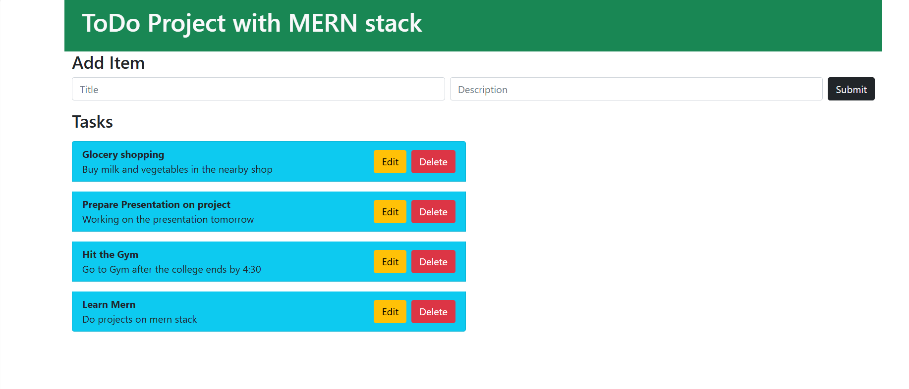

# 📝 ToDo List Web App – MERN Stack

## 🚀 Project Overview

This is a full-stack ToDo List web application built using the **MERN stack**. It allows users to:

- ✅ Add new tasks with a title and description  
- ✅ Edit existing tasks  
- ✅ Delete tasks  
- ✅ View all tasks dynamically updated in the UI  

---

## 🔧 Tech Stack

- **MongoDB** – Stores tasks persistently in a NoSQL database  
- **Express.js** – Handles RESTful API development  
- **React.js** – Frontend interface with dynamic rendering  
- **Node.js** – Server-side runtime and backend logic  
- **Postman** – Used for testing and debugging backend APIs  
- **Bootstrap** – Used for styling and responsive layout  

---

## 📚 Learning Highlights

Earlier, I created a basic ToDo app that used browser storage (`localStorage`) to handle data on the client side.

With this project, I stepped up into **full-stack development** by:

- Managing asynchronous API calls  
- Connecting frontend and backend seamlessly  
- Implementing complete **CRUD** operations  
- Designing and styling a modern, responsive UI  

This project helped me gain a deeper understanding of how full-stack web apps work using the MERN stack, and I’m excited to keep building and exploring more advanced concepts!

---

## Screenshot

---
## Author

Eshwar
https://github.com/eshwarvk